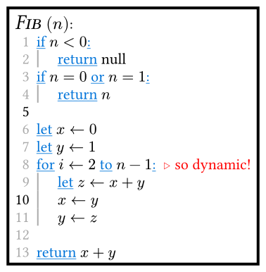

# Algo

A Typst library for writing algorithms. On Typst v0.6.0+ you can import the `algo` package:

```typst
#import "@preview/algo:0.3.3": algo, i, d, comment, code
```

Otherwise, add the `algo.typ` file to your project and import it as normal:

```typst
#import "algo.typ": algo, i, d, comment, code
```

Use the `algo` function for writing pseudocode and the `code` function for writing code blocks with line numbers. Check out the [examples](#examples) below for a quick overview. See the [usage](#usage) section to read about all the options each function has.

## Examples

Here's a basic use of `algo`:

```typst
#algo(
  title: "Fib",
  parameters: ("n",)
)[
  if $n < 0$:#i\        // use #i to indent the following lines
    return null#d\      // use #d to dedent the following lines
  if $n = 0$ or $n = 1$:#i #comment[you can also]\
    return $n$#d #comment[add comments!]\
  return #smallcaps("Fib")$(n-1) +$ #smallcaps("Fib")$(n-2)$
]
```


<br />

Here's a use of `algo` without a title, parameters, line numbers, or syntax highlighting:

```typst
#algo(
  line-numbers: false,
  keyword-styles: none
)[
  if $n < 0$:#i\
    return null#d\
  if $n = 0$ or $n = 1$:#i\
    return $n$#d\
  \
  let $x <- 0$\
  let $y <- 1$\
  for $i <- 2$ to $n-1$:#i #comment[so dynamic!]\
    let $z <- x+y$\
    $x <- y$\
    $y <- z$#d\
    \
  return $x+y$
]
```


<br />

And here's `algo` with more styling options:

```typst
#algo(
  title: [                    // note that title and parameters
    #set text(size: 15pt)     // can be content
    #emph(smallcaps("Fib"))
  ],
  parameters: ([#math.italic("n")],),
  comment-prefix: [#sym.triangle.stroked.r ],
  comment-styles: x => text(fill: rgb(100%, 0%, 0%), x),
  indent-size: 15pt,
  indent-guides: 1pt + gray,
  row-gutter: 5pt,
  column-gutter: 5pt,
  inset: 5pt,
  stroke: 2pt + black,
  fill: none,
  keyword-styles: x => underline(text(blue, x)),
  line-number-styles: i => if calc.rem(i, 5) != 0 {
    text(gray)[#i]
  } else [#i]
)[
  if $n < 0$:#i\
    return null#d\
  if $n = 0$ or $n = 1$:#i\
    return $n$#d\
  \
  let $x <- 0$\
  let $y <- 1$\
  for $i <- 2$ to $n-1$:#i #comment[so dynamic!]\
    let $z <- x+y$\
    $x <- y$\
    $y <- z$#d\
    \
  return $x+y$
]
```



&nbsp;

Here's a basic use of `code`:

````typst
#code()[
  ```py
  def fib(n):
    if n < 0:
      return None
    if n == 0 or n == 1:        # this comment is
      return n                  # normal raw text
    return fib(n-1) + fib(n-2)
  ```
]
````


<br />

And here's `code` with some styling options:

````typst
#code(
  indent-guides: 1pt + gray,
  row-gutter: 5pt,
  column-gutter: 5pt,
  inset: 5pt,
  stroke: 2pt + black,
  fill: none,
)[
  ```py
  def fib(n):
      if n < 0:
          return None
      if n == 0 or n == 1:        # this comment is
          return n                # normal raw text
      return fib(n-1) + fib(n-2)
  ```
]
````


## Usage

### `algo`

Makes a pseudocode element.

```typst
algo(
  body,
  header: none,
  title: none,
  parameters: (),
  line-numbers: true,
  keyword-styles: strong,
  keywords: _algo-default-keywords, // see below
  comment-prefix: "// ",
  indent-size: 20pt,
  indent-guides: none,
  indent-guides-offset: 0pt,
  row-gutter: 10pt,
  column-gutter: 10pt,
  inset: 10pt,
  fill: rgb(98%, 98%, 98%),
  stroke: 1pt + rgb(50%, 50%, 50%),
  radius: 0pt,
  breakable: false,
  block-align: center,
  main-text-styles: x => x,
  comment-styles: x => text(fill: rgb(45%, 45%, 45%))[#x],
  line-number-styles: i => [#i]
)
```

**Parameters:**

*   `body`: `content` &mdash; Main algorithm content.

*   `header`: `content` &mdash; Algorithm header. If specified, `title` and `parameters` are ignored.

*   `title`: `string` or `content` &mdash; Algorithm title. Ignored if `header` is specified.

*   `Parameters`: `array` &mdash; List of algorithm parameters. Elements can be `string` or `content` values. `string` values will automatically be displayed in math mode. Ignored if `header` is specified.

*   `line-numbers`: `boolean` &mdash; Whether to display line numbers.

*   `keyword-styles`: `content -> content` &mdash; A styling function to apply to keywords. The default function is `strong`, making keywords bold. If `none` is used, the identity function `x => x` will be used, i.e. keywords will not have special styling. Take a look at the examples to understand how this works.

*   `keywords`: `array` &mdash; List of terms to receive strong emphasis. Elements must be `string` or `regex` values, while `string`s are prefered. Ignored if `keyword-styles` is `none`.

    The default list of keywords is stored in `_algo-default-keywords`. This list contains the following terms:

    ```
    ("if", "else", "then", "while", "for",
    "repeat", "do", "until", ":", "end",
    "and", "or", "not", "in", "to",
    "down", "let", "return", "goto")
    ```

    Note that for each of the above terms, `_algo-default-keywords` also contains the uppercase form of the term (e.g. "for" and "For").

    Note that algo currently uses regex to match keywords, so that
    - you can also use regex expressions like `"colou?r"`
    - you must escape special characters (`*`, `+`, `(`, `)`, and more)
    However, if the expression starts or ends with a special character, this can yield unexpected behaviour. In this case `regex` together with regex word boundaries should be used: `regex("\b{start}while( let)?\b{end}")`

*   `comment-prefix`: `content` &mdash; What to prepend comments with.

*   `indent-size`: `length` &mdash; Size of line indentations.

*   `indent-guides`: `stroke` &mdash; Stroke for indent guides.

*   `indent-guides-offset`: `length` &mdash; Horizontal offset of indent guides.

*   `row-gutter`: `length` &mdash; Space between lines.

*   `column-gutter`: `length` &mdash; Space between line numbers, text, and comments.

*   `inset`: `length` &mdash; Size of inner padding.

*   `fill`: `color` &mdash; Fill color.

*   `stroke`: `stroke` &mdash; Stroke for the element's border.

*   `radius`: `length` &mdash; Corner radius.

*   `breakable`: `boolean` &mdash; Whether the element can break across pages. WARNING: indent guides may look off when broken across pages.

*   `block-align`: `none` or `alignment` or `2d alignment` &mdash; Alignment of the `algo` on the page. Using `none` will cause the internal `block` element to be returned as-is.

*   `main-text-styles`: `content -> content` &mdash; Styling function to apply to the main algorithm text. Works similar to the `keyword-styles` argument.

*   `comment-styles`: `content -> content` &mdash; Styling function to apply to comments. Works similar to the `keyword-styles` argument.

*   `line-number-styles`: `int -> content` &mdash; Styling function to apply to line numbers. Works similar to the `keyword-styles` argument, *but* the argument is the line number, making it possible to perform case destinction, e.g. to only display line numbers, which are a multiple of 5.

### `i` and `d`

For use in an `algo` body. `#i` indents all following lines and `#d` dedents all following lines.

### `comment`

For use in an `algo` body. Adds a comment to the line in which it's placed.

```typst
comment(
  body,
  inline: false
)
```

**Parameters:**

*   `body`: `content` &mdash; Comment content.

*   `inline`: `boolean` &mdash; If true, the comment is displayed in place rather than on the right side.

    NOTE: inline comments will respect both `main-text-styles` and `comment-styles`, preferring `comment-styles` when the two conflict.

    NOTE: to make inline comments insensitive to `strong-keywords`, strong emphasis is disabled within them. This can be circumvented via the `text` function:

    ```typst
    #comment(inline: true)[#text(weight: 700)[...]]
    ```

### `no-keyword`

For use in an `algo` body. Prevents the passed content from being recognised as a keyword. If a word appears in your algorithm both as a keyword and as normal text, you may escape the non-keyword usages via this function.

```typst
no-keyowrd(
  body
)
```

**Parameters:**

*   `body`: `content` &mdash; Content to display without emphasis.

### `code`

Makes a code block element.

```typst
code(
  body,
  line-numbers: true,
  indent-guides: none,
  indent-guides-offset: 0pt,
  tab-size: auto,
  row-gutter: 10pt,
  column-gutter: 10pt,
  inset: 10pt,
  fill: rgb(98%, 98%, 98%),
  stroke: 1pt + rgb(50%, 50%, 50%),
  radius: 0pt,
  breakable: false,
  block-align: center,
  main-text-styles: x => x,
  line-number-styles: i => [#i]
)
```

**Parameters:**

*   `body`: `content` &mdash; Main content. Expects `raw` text.

*   `line-numbers`: `boolean` &mdash; Whether to display line numbers.

*   `indent-guides`: `stroke` &mdash; Stroke for indent guides.

*   `indent-guides-offset`: `length` &mdash; Horizontal offset of indent guides.

*   `tab-size`: `integer` &mdash; Amount of spaces that should be considered an indent. If unspecified, the tab size is determined automatically from the first instance of starting whitespace.

*   `row-gutter`: `length` &mdash; Space between lines.

*   `column-gutter`: `length` &mdash; Space between line numbers and text.

*   `inset`: `length` &mdash; Size of inner padding.

*   `fill`: `color` &mdash; Fill color.

*   `stroke`: `stroke` &mdash; Stroke for the element's border.

*   `radius`: `length` &mdash; Corner radius.

*   `breakable`: `boolean` &mdash; Whether the element can break across pages. WARNING: indent guides may look off when broken across pages.

*   `block-align`: `none` or `alignment` or `2d alignment` &mdash; Alignment of the `code` on the page. Using `none` will cause the internal `block` element to be returned as-is.

*   `main-text-styles`: `content -> content` &mdash; Styling function to apply to the main raw text. Works similar to the same argument for the `algo` function.

*   `line-number-styles`: `int -> content` &mdash; Styling function to apply to line numbers. Works similar to the same argument for the `algo` function.

## Contributing

PRs are welcome! And if you encounter any bugs or have any requests/ideas, feel free to open an issue.
